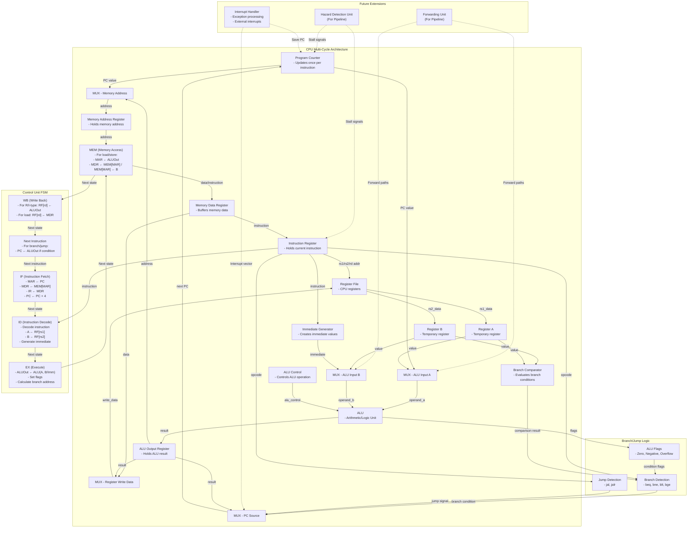
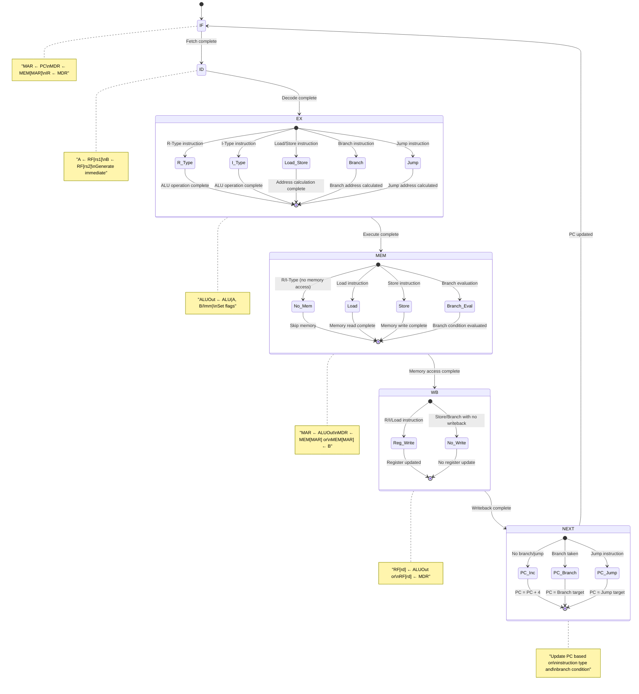

# Kiến trúc CPU Multi-Cycle

Tài liệu này mô tả thiết kế chi tiết của một CPU multi-cycle, bao gồm các module chính, sơ đồ trạng thái FSM, và các cơ chế xử lý branch/jump.

## Sơ đồ khối CPU Multi-Cycle

## Sơ đồ trạng thái FSM chi tiết

## Các thành phần chính

### 1. Sơ đồ trạng thái FSM chi tiết

Máy trạng thái hữu hạn (FSM) của CPU multi-cycle bao gồm các trạng thái sau:

- **IF (Instruction Fetch)**: 
  - Đặt MAR = PC
  - Đọc bộ nhớ: MDR = MEM[MAR]
  - Lưu lệnh vào IR: IR = MDR
  - Tăng PC: PC = PC + 4 (tạm thời, có thể thay đổi ở trạng thái NEXT)

- **ID (Instruction Decode)**:
  - Giải mã lệnh từ IR
  - Đọc thanh ghi nguồn: A = RF[rs1], B = RF[rs2]
  - Tạo giá trị immediate từ lệnh
  - Tạo tín hiệu điều khiển cho các trạng thái tiếp theo

- **EX (Execute)**:
  - Thực hiện phép toán ALU: ALUOut = ALU(A, B/Imm)
  - Thiết lập các cờ (zero, negative, overflow)
  - Tính toán địa chỉ đích cho lệnh branch/jump

- **MEM (Memory Access)**:
  - Cho lệnh load/store: MAR = ALUOut
  - Lệnh load: MDR = MEM[MAR]
  - Lệnh store: MEM[MAR] = B
  - Đánh giá điều kiện rẽ nhánh

- **WB (Write Back)**:
  - Lệnh R/I-type: RF[rd] = ALUOut
  - Lệnh load: RF[rd] = MDR

- **NEXT (Next Instruction)**:
  - Cập nhật PC dựa trên loại lệnh và điều kiện rẽ nhánh
  - PC = PC (đã tăng ở IF) nếu không nhảy
  - PC = Branch target nếu điều kiện rẽ nhánh đúng
  - PC = Jump target cho lệnh jump

### 2. Xử lý Branch/Jump chi tiết

Cơ chế xử lý Branch/Jump bao gồm:

- **Branch Detection**:
  - Phát hiện các lệnh rẽ nhánh (beq, bne, blt, bge, bltu, bgeu)
  - Sử dụng opcode và funct3 để xác định loại lệnh branch
  - Kết hợp với ALU flags để đánh giá điều kiện

- **Jump Detection**:
  - Phát hiện các lệnh nhảy (jal, jalr)
  - Tạo tín hiệu điều khiển cho việc cập nhật PC
  - Lưu địa chỉ trở về (PC+4) vào thanh ghi đích (rd) nếu cần

- **ALU Flags**:
  - Zero: Kết quả ALU bằng 0
  - Negative: Kết quả ALU là số âm
  - Overflow: Phép toán ALU gây tràn số

- **Branch Comparator**:
  - So sánh giá trị từ thanh ghi rs1 và rs2
  - Tạo kết quả so sánh (bằng, khác, nhỏ hơn, lớn hơn)
  - Kết hợp với loại lệnh branch để quyết định có nhảy hay không

### 3. Chuẩn bị cho mở rộng tương lai

Kiến trúc này có thể mở rộng trong tương lai với:

- **Forwarding Unit**:
  - Phát hiện data hazard trong pipeline
  - Chuyển dữ liệu trực tiếp từ các giai đoạn sau về giai đoạn EX
  - Giảm thiểu stall và tăng hiệu suất

- **Hazard Detection Unit**:
  - Phát hiện các hazard không thể giải quyết bằng forwarding
  - Tạo tín hiệu stall khi cần thiết
  - Xử lý load-use hazard và control hazard

- **Interrupt Handler**:
  - Xử lý ngắt và ngoại lệ
  - Lưu trạng thái CPU khi có ngắt
  - Nhảy đến vector ngắt và trở về sau khi xử lý

## Ưu điểm của kiến trúc Multi-Cycle

1. **Tối ưu tài nguyên phần cứng**:
   - Sử dụng lại ALU và các thành phần khác cho nhiều giai đoạn
   - Giảm diện tích chip và chi phí

2. **Linh hoạt trong thiết kế**:
   - Các lệnh khác nhau có thể sử dụng số chu kỳ khác nhau
   - Lệnh đơn giản hoàn thành nhanh hơn

3. **Dễ dàng mở rộng**:
   - Có thể thêm lệnh mới mà không cần thay đổi lớn về phần cứng
   - Nền tảng tốt để phát triển lên kiến trúc pipeline

4. **Điều khiển đơn giản hơn**:
   - Mỗi chu kỳ chỉ thực hiện một phần của lệnh
   - Giảm độ phức tạp của đường dẫn dữ liệu

## Nhược điểm

1. **Hiệu suất thấp hơn**:
   - Mỗi lệnh cần nhiều chu kỳ để hoàn thành
   - Thời gian thực thi trung bình cao hơn so với pipeline

2. **Độ phức tạp của FSM**:
   - Máy trạng thái phức tạp hơn so với CPU single-cycle
   - Cần xử lý nhiều trường hợp đặc biệt

## Kết luận

Kiến trúc CPU multi-cycle cung cấp sự cân bằng tốt giữa hiệu suất và chi phí phần cứng. Nó là một bước tiến so với kiến trúc single-cycle và là nền tảng để phát triển lên kiến trúc pipeline phức tạp hơn. Với các thành phần đã được thiết kế, CPU multi-cycle này có thể thực thi đầy đủ bộ lệnh RISC và dễ dàng mở rộng với các tính năng nâng cao trong tương lai. 