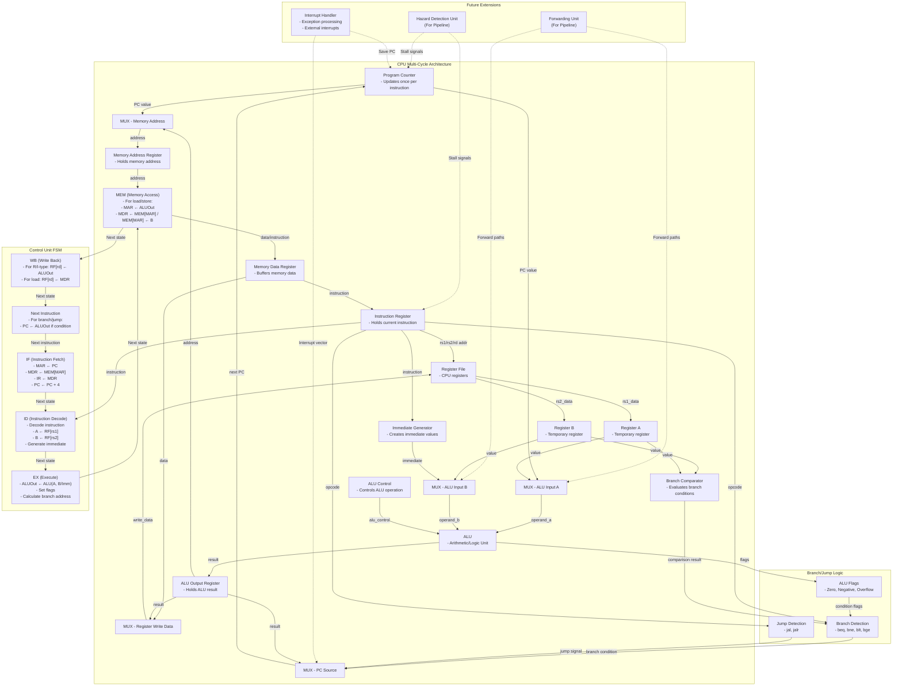

# Kiến trúc CPU Multi-Cycle

Tài liệu này mô tả thiết kế chi tiết của một CPU multi-cycle, bao gồm các module chính, sơ đồ trạng thái FSM, và các cơ chế xử lý branch/jump.

## Sơ đồ khối CPU Multi-Cycle



## Sơ đồ trạng thái FSM chi tiết


## Các thành phần chính

### 1. Sơ đồ trạng thái FSM chi tiết

Máy trạng thái hữu hạn (FSM) của CPU multi-cycle bao gồm các trạng thái sau:

- **IF (Instruction Fetch)**: 
  - Đặt MAR = PC
  - Đọc bộ nhớ: MDR = MEM[MAR]
  - Lưu lệnh vào IR: IR = MDR
  - Tăng PC: PC = PC + 4 (tạm thời, có thể thay đổi ở trạng thái NEXT)

- **ID (Instruction Decode)**:
  - Giải mã lệnh từ IR
  - Đọc thanh ghi nguồn: A = RF[rs1], B = RF[rs2]
  - Tạo giá trị immediate từ lệnh
  - Tạo tín hiệu điều khiển cho các trạng thái tiếp theo

- **EX (Execute)**:
  - Thực hiện phép toán ALU: ALUOut = ALU(A, B/Imm)
  - Thiết lập các cờ (zero, negative, overflow)
  - Tính toán địa chỉ đích cho lệnh branch/jump

- **MEM (Memory Access)**:
  - Cho lệnh load/store: MAR = ALUOut
  - Lệnh load: MDR = MEM[MAR]
  - Lệnh store: MEM[MAR] = B
  - Đánh giá điều kiện rẽ nhánh

- **WB (Write Back)**:
  - Lệnh R/I-type: RF[rd] = ALUOut
  - Lệnh load: RF[rd] = MDR

- **NEXT (Next Instruction)**:
  - Cập nhật PC dựa trên loại lệnh và điều kiện rẽ nhánh
  - PC = PC (đã tăng ở IF) nếu không nhảy
  - PC = Branch target nếu điều kiện rẽ nhánh đúng
  - PC = Jump target cho lệnh jump

### 2. Xử lý Branch/Jump chi tiết

Cơ chế xử lý Branch/Jump bao gồm:

- **Branch Detection**:
  - Phát hiện các lệnh rẽ nhánh (beq, bne, blt, bge, bltu, bgeu)
  - Sử dụng opcode và funct3 để xác định loại lệnh branch
  - Kết hợp với ALU flags để đánh giá điều kiện

- **Jump Detection**:
  - Phát hiện các lệnh nhảy (jal, jalr)
  - Tạo tín hiệu điều khiển cho việc cập nhật PC
  - Lưu địa chỉ trở về (PC+4) vào thanh ghi đích (rd) nếu cần

- **ALU Flags**:
  - Zero: Kết quả ALU bằng 0
  - Negative: Kết quả ALU là số âm
  - Overflow: Phép toán ALU gây tràn số

- **Branch Comparator**:
  - So sánh giá trị từ thanh ghi rs1 và rs2
  - Tạo kết quả so sánh (bằng, khác, nhỏ hơn, lớn hơn)
  - Kết hợp với loại lệnh branch để quyết định có nhảy hay không

### 3. Chuẩn bị cho mở rộng tương lai

Kiến trúc này có thể mở rộng trong tương lai với:

- **Forwarding Unit**:
  - Phát hiện data hazard trong pipeline
  - Chuyển dữ liệu trực tiếp từ các giai đoạn sau về giai đoạn EX
  - Giảm thiểu stall và tăng hiệu suất

- **Hazard Detection Unit**:
  - Phát hiện các hazard không thể giải quyết bằng forwarding
  - Tạo tín hiệu stall khi cần thiết
  - Xử lý load-use hazard và control hazard

- **Interrupt Handler**:
  - Xử lý ngắt và ngoại lệ
  - Lưu trạng thái CPU khi có ngắt
  - Nhảy đến vector ngắt và trở về sau khi xử lý

## Ưu điểm của kiến trúc Multi-Cycle

1. **Tối ưu tài nguyên phần cứng**:
   - Sử dụng lại ALU và các thành phần khác cho nhiều giai đoạn
   - Giảm diện tích chip và chi phí

2. **Linh hoạt trong thiết kế**:
   - Các lệnh khác nhau có thể sử dụng số chu kỳ khác nhau
   - Lệnh đơn giản hoàn thành nhanh hơn

3. **Dễ dàng mở rộng**:
   - Có thể thêm lệnh mới mà không cần thay đổi lớn về phần cứng
   - Nền tảng tốt để phát triển lên kiến trúc pipeline

4. **Điều khiển đơn giản hơn**:
   - Mỗi chu kỳ chỉ thực hiện một phần của lệnh
   - Giảm độ phức tạp của đường dẫn dữ liệu

## Nhược điểm

1. **Hiệu suất thấp hơn**:
   - Mỗi lệnh cần nhiều chu kỳ để hoàn thành
   - Thời gian thực thi trung bình cao hơn so với pipeline

2. **Độ phức tạp của FSM**:
   - Máy trạng thái phức tạp hơn so với CPU single-cycle
   - Cần xử lý nhiều trường hợp đặc biệt

## Kết luận

Kiến trúc CPU multi-cycle cung cấp sự cân bằng tốt giữa hiệu suất và chi phí phần cứng. Nó là một bước tiến so với kiến trúc single-cycle và là nền tảng để phát triển lên kiến trúc pipeline phức tạp hơn. Với các thành phần đã được thiết kế, CPU multi-cycle này có thể thực thi đầy đủ bộ lệnh RISC và dễ dàng mở rộng với các tính năng nâng cao trong tương lai.

## Đặc tả chi tiết các module

### 1. Program Counter (PC)
- **Chức năng**: Lưu trữ địa chỉ lệnh hiện tại và cập nhật theo chu kỳ lệnh.
- **Đầu vào**:
  - `clk`: Tín hiệu xung nhịp (1 bit)
  - `reset`: Tín hiệu reset (1 bit)
  - `pc_next`: Địa chỉ tiếp theo (32 bit)
  - `pc_write`: Tín hiệu cho phép ghi PC (1 bit)
- **Đầu ra**:
  - `pc_current`: Địa chỉ hiện tại (32 bit)
- **Specifications**:
  - Khi `reset=1`, PC sẽ reset về 0x00000000
  - Chỉ cập nhật khi `pc_write=1` và xung `clk` lên
  - Độ rộng mặc định là 32 bit

### 2. Instruction Register (IR)
- **Chức năng**: Lưu trữ lệnh hiện tại đang được thực thi.
- **Đầu vào**:
  - `clk`: Tín hiệu xung nhịp (1 bit)
  - `reset`: Tín hiệu reset (1 bit)
  - `ir_write`: Tín hiệu cho phép ghi IR (1 bit)
  - `instruction_in`: Lệnh đầu vào từ MDR (32 bit)
- **Đầu ra**:
  - `instruction_out`: Lệnh đầu ra (32 bit)
  - `opcode`: Mã hoạt động (7 bit cho RISC-V)
  - `rd`: Địa chỉ thanh ghi đích (5 bit)
  - `rs1`: Địa chỉ thanh ghi nguồn 1 (5 bit)
  - `rs2`: Địa chỉ thanh ghi nguồn 2 (5 bit)
  - `funct3`: Mã hàm phụ 3-bit (3 bit)
  - `funct7`: Mã hàm phụ 7-bit (7 bit)
- **Specifications**:
  - Cập nhật đồng bộ khi `ir_write=1` và xung `clk` lên
  - Giải mã các trường lệnh (opcode, rd, rs1, rs2, funct3, funct7)
  - Hỗ trợ định dạng lệnh RISC-V

### 3. Memory Address Register (MAR)
- **Chức năng**: Lưu trữ địa chỉ bộ nhớ cần truy cập.
- **Đầu vào**:
  - `clk`: Tín hiệu xung nhịp (1 bit)
  - `reset`: Tín hiệu reset (1 bit)
  - `mar_write`: Tín hiệu cho phép ghi MAR (1 bit)
  - `address_in`: Địa chỉ đầu vào (32 bit)
- **Đầu ra**:
  - `address_out`: Địa chỉ đầu ra (32 bit)
- **Specifications**:
  - Cập nhật đồng bộ khi `mar_write=1` và xung `clk` lên
  - Độ rộng mặc định là 32 bit
  - Được sử dụng cho cả truy cập lệnh và dữ liệu

### 4. Memory Data Register (MDR)
- **Chức năng**: Đệm dữ liệu đọc/ghi từ/đến bộ nhớ.
- **Đầu vào**:
  - `clk`: Tín hiệu xung nhịp (1 bit)
  - `reset`: Tín hiệu reset (1 bit)
  - `mdr_write`: Tín hiệu cho phép ghi MDR (1 bit)
  - `data_in`: Dữ liệu đầu vào (32 bit)
- **Đầu ra**:
  - `data_out`: Dữ liệu đầu ra (32 bit)
- **Specifications**:
  - Cập nhật đồng bộ khi `mdr_write=1` và xung `clk` lên
  - Độ rộng mặc định là 32 bit
  - Được sử dụng cho cả lệnh và dữ liệu

### 5. Register File
- **Chức năng**: Lưu trữ các thanh ghi của CPU.
- **Đầu vào**:
  - `clk`: Tín hiệu xung nhịp (1 bit)
  - `reset`: Tín hiệu reset (1 bit)
  - `reg_write`: Cho phép ghi vào thanh ghi (1 bit)
  - `rs1_addr`: Địa chỉ thanh ghi đọc 1 (5 bit)
  - `rs2_addr`: Địa chỉ thanh ghi đọc 2 (5 bit)
  - `rd_addr`: Địa chỉ thanh ghi ghi (5 bit)
  - `write_data`: Dữ liệu cần ghi (32 bit)
- **Đầu ra**:
  - `rs1_data`: Dữ liệu đọc từ thanh ghi 1 (32 bit)
  - `rs2_data`: Dữ liệu đọc từ thanh ghi 2 (32 bit)
- **Specifications**:
  - 32 thanh ghi x 32 bit (x0 đến x31 cho RISC-V)
  - Thanh ghi x0 luôn bằng 0
  - Đọc không đồng bộ (combinational)
  - Ghi đồng bộ theo xung `clk` khi `reg_write=1`

### 6. Register A và Register B
- **Chức năng**: Lưu trữ tạm thời dữ liệu từ Register File.
- **Đầu vào**:
  - `clk`: Tín hiệu xung nhịp (1 bit)
  - `reset`: Tín hiệu reset (1 bit)
  - `reg_write`: Cho phép ghi vào thanh ghi (1 bit)
  - `data_in`: Dữ liệu đầu vào (32 bit)
- **Đầu ra**:
  - `data_out`: Dữ liệu đầu ra (32 bit)
- **Specifications**:
  - Cập nhật đồng bộ khi `reg_write=1` và xung `clk` lên
  - Độ rộng mặc định là 32 bit

### 7. ALU (Arithmetic Logic Unit)
- **Chức năng**: Thực hiện các phép toán số học và logic.
- **Đầu vào**:
  - `operand_a`: Toán hạng A (32 bit)
  - `operand_b`: Toán hạng B (32 bit)
  - `alu_control`: Mã phép toán (4 bit)
- **Đầu ra**:
  - `result`: Kết quả phép toán (32 bit)
  - `zero`: Cờ báo kết quả bằng 0 (1 bit)
  - `negative`: Cờ báo kết quả âm (1 bit)
  - `overflow`: Cờ báo tràn số (1 bit)
- **Specifications**:
  - Hỗ trợ các phép toán: ADD, SUB, AND, OR, XOR, SLL, SRL, SRA, SLT, SLTU
  - Mã phép toán 4 bit để hỗ trợ 10-16 phép toán
  - Hoạt động không đồng bộ (combinational)

### 8. ALU Output Register
- **Chức năng**: Lưu trữ kết quả từ ALU.
- **Đầu vào**:
  - `clk`: Tín hiệu xung nhịp (1 bit)
  - `reset`: Tín hiệu reset (1 bit)
  - `alu_out_write`: Cho phép ghi (1 bit)
  - `result_in`: Kết quả đầu vào từ ALU (32 bit)
- **Đầu ra**:
  - `result_out`: Kết quả đầu ra (32 bit)
- **Specifications**:
  - Cập nhật đồng bộ khi `alu_out_write=1` và xung `clk` lên
  - Độ rộng mặc định là 32 bit

### 9. ALU Control Unit
- **Chức năng**: Xác định phép toán ALU cụ thể.
- **Đầu vào**:
  - `ALUOp`: Mã phép toán từ control unit (2 bit)
  - `funct3`: Mã hàm phụ 3-bit từ instruction (3 bit)   
  - `funct7`: Mã hàm phụ 7-bit từ instruction (7 bit)
- **Đầu ra**:
  - `alu_control`: Mã điều khiển ALU (4 bit)
- **Specifications**:
  - Dựa vào `ALUOp`, `funct3` và `funct7` để xác định chính xác phép toán ALU
  - Hoạt động không đồng bộ (combinational)
  - Hỗ trợ các lệnh R-type, I-type, load/store, branch

### 10. Immediate Generator
- **Chức năng**: Giải mã giá trị immediate từ lệnh.
- **Đầu vào**:
  - `instruction`: Mã lệnh (32 bit)
  - `imm_type`: Loại immediate (3 bit)
- **Đầu ra**:
  - `immediate`: Giá trị immediate đã mở rộng dấu (32 bit)  
- **Specifications**:
  - Hỗ trợ các định dạng immediate: I-type, S-type, B-type, U-type, J-type
  - Tự động mở rộng dấu (sign extension)
  - Hoạt động không đồng bộ (combinational)

### 11. Memory
- **Chức năng**: Lưu trữ cả lệnh và dữ liệu.
- **Đầu vào**:
  - `clk`: Tín hiệu xung nhịp (1 bit)
  - `address`: Địa chỉ bộ nhớ (32 bit)
  - `write_data`: Dữ liệu cần ghi (32 bit)
  - `mem_write`: Cho phép ghi (1 bit)
  - `mem_read`: Cho phép đọc (1 bit)
- **Đầu ra**:
  - `read_data`: Dữ liệu đọc được (32 bit)
- **Specifications**:
  - Kích thước bộ nhớ: 4KB-16KB, có thể tùy chỉnh
  - Đọc không đồng bộ (combinational) khi `mem_read=1`
  - Ghi đồng bộ theo xung `clk` khi `mem_write=1`
  - Hỗ trợ đọc/ghi byte, half-word, word

### 12. Branch Comparator
- **Chức năng**: So sánh giá trị từ thanh ghi để quyết định rẽ nhánh.
- **Đầu vào**:
  - `rs1_data`: Dữ liệu từ thanh ghi 1 (32 bit)
  - `rs2_data`: Dữ liệu từ thanh ghi 2 (32 bit)
  - `branch_op`: Loại phép so sánh (3 bit)
- **Đầu ra**:
  - `branch_result`: Kết quả so sánh (1 bit)
- **Specifications**:
  - Hỗ trợ các phép so sánh: bằng, khác, nhỏ hơn, lớn hơn, nhỏ hơn hoặc bằng, lớn hơn hoặc bằng
  - Hỗ trợ so sánh có dấu và không dấu
  - Hoạt động không đồng bộ (combinational)

### 13. Control Unit
- **Chức năng**: Điều khiển toàn bộ CPU dựa trên máy trạng thái FSM.
- **Đầu vào**:
  - `clk`: Tín hiệu xung nhịp (1 bit)
  - `reset`: Tín hiệu reset (1 bit)
  - `opcode`: Mã hoạt động từ IR (7 bit)
  - `funct3`: Mã hàm phụ 3-bit từ IR (3 bit)
  - `funct7`: Mã hàm phụ 7-bit từ IR (7 bit)
  - `zero`: Cờ zero từ ALU (1 bit)
  - `negative`: Cờ negative từ ALU (1 bit)
  - `branch_result`: Kết quả so sánh từ Branch Comparator (1 bit)
- **Đầu ra**:
  - `pc_write`: Cho phép ghi PC (1 bit)
  - `ir_write`: Cho phép ghi IR (1 bit)
  - `mar_write`: Cho phép ghi MAR (1 bit)
  - `mdr_write`: Cho phép ghi MDR (1 bit)
  - `reg_write`: Cho phép ghi Register File (1 bit)
  - `a_write`: Cho phép ghi Register A (1 bit)
  - `b_write`: Cho phép ghi Register B (1 bit)
  - `alu_out_write`: Cho phép ghi ALU Output Register (1 bit)
  - `mem_read`: Cho phép đọc Memory (1 bit)
  - `mem_write`: Cho phép ghi Memory (1 bit)
  - `ALUOp`: Mã phép toán cho ALU Control (2 bit)
  - `ALUSrcA`: Chọn nguồn toán hạng A cho ALU (2 bit)
  - `ALUSrcB`: Chọn nguồn toán hạng B cho ALU (2 bit)
  - `PCSource`: Chọn nguồn cập nhật PC (2 bit)
  - `RegDst`: Chọn địa chỉ thanh ghi đích (1 bit)
  - `MemtoReg`: Chọn nguồn dữ liệu ghi vào thanh ghi (1 bit)
  - `IorD`: Chọn nguồn địa chỉ bộ nhớ (1 bit)
  - `imm_type`: Loại immediate cần tạo (3 bit)
  - `branch_op`: Loại phép so sánh cho Branch Comparator (3 bit)
  - `current_state`: Trạng thái hiện tại của FSM (4 bit)
- **Specifications**:
  - Máy trạng thái 6 trạng thái chính: IF, ID, EX, MEM, WB, NEXT
  - Mỗi trạng thái chính có thể có các trạng thái con tùy thuộc loại lệnh
  - Tạo tín hiệu điều khiển dựa trên trạng thái hiện tại và loại lệnh
  - Chuyển trạng thái đồng bộ theo xung `clk`

### 14. Multiplexers
- **Chức năng**: Chọn đường đi dữ liệu trong datapath.
- **Đầu vào**:
  - `select`: Tín hiệu chọn (1-2 bit)
  - `input0`, `input1`, `input2`, `input3`: Các đầu vào (32 bit mỗi đầu vào)
- **Đầu ra**:
  - `output`: Đầu ra được chọn (32 bit)
- **Specifications**:
  - MUX 2-to-1: 1 bit select, 2 đầu vào
  - MUX 4-to-1: 2 bit select, 4 đầu vào
  - Hoạt động không đồng bộ (combinational)

## Đặc tả tổng thể hệ thống

### Kiến trúc tổng thể
- **Kiến trúc**: Multi-cycle RISC CPU
- **Độ rộng dữ liệu**: 32 bit
- **Bộ lệnh**: RISC-V RV32I hoặc tương đương
- **Tần số hoạt động**: 50-100MHz (tùy thuộc vào công nghệ FPGA/ASIC)
- **Chu kỳ lệnh**: 3-5 chu kỳ xung nhịp trung bình cho mỗi lệnh

### Yêu cầu chức năng
1. **Thực thi lệnh**:
   - Hỗ trợ đầy đủ các lệnh cơ bản: số học, logic, load/store, branch, jump
   - Thực hiện chính xác các lệnh theo đặc tả bộ lệnh

2. **Quản lý bộ nhớ**:
   - Hỗ trợ không gian địa chỉ 32 bit
   - Truy cập bộ nhớ theo byte, half-word, word
   - Hỗ trợ byte ordering (little-endian hoặc big-endian)

3. **Điều khiển luồng**:
   - Xử lý chính xác các lệnh rẽ nhánh có điều kiện
   - Xử lý chính xác các lệnh nhảy không điều kiện
   - Lưu địa chỉ trở về cho lệnh jal/jalr

4. **Reset và khởi động**:
   - Khởi tạo chính xác tất cả các thanh ghi khi reset
   - Bắt đầu thực thi từ địa chỉ 0x00000000

### Yêu cầu hiệu năng
1. **Thời gian thực thi**:
   - Lệnh R-type: 4 chu kỳ
   - Lệnh I-type: 4 chu kỳ
   - Lệnh load: 5 chu kỳ
   - Lệnh store: 4 chu kỳ
   - Lệnh branch (không nhảy): 3 chu kỳ
   - Lệnh branch (có nhảy): 3 chu kỳ
   - Lệnh jump: 3 chu kỳ

2. **Tài nguyên phần cứng**:
   - Tối ưu hóa sử dụng tài nguyên FPGA/ASIC
   - Giảm thiểu số lượng LUT, FF, BRAM sử dụng

3. **Tiêu thụ năng lượng**:
   - Tối ưu hóa tiêu thụ năng lượng động và tĩnh
   - Hỗ trợ chế độ tiết kiệm năng lượng (tùy chọn)

### Giao diện
1. **Giao diện bên ngoài**:
   - Tín hiệu clock, reset
   - Giao diện bộ nhớ ngoài (tùy chọn)
   - Giao diện ngắt (tùy chọn)
   - Giao diện debug (tùy chọn)

2. **Giao diện giữa các module**:
   - Tuân thủ giao thức handshaking khi cần thiết
   - Tín hiệu điều khiển rõ ràng và đầy đủ

## Testplan

### 1. Unit Testing
- **Program Counter**: 
  - Kiểm tra reset về 0x00000000
  - Kiểm tra cập nhật PC khi pc_write=1
  - Kiểm tra giữ nguyên PC khi pc_write=0

- **Instruction Register**:
  - Kiểm tra cập nhật IR khi ir_write=1
  - Kiểm tra giữ nguyên IR khi ir_write=0
  - Kiểm tra giải mã đúng các trường của lệnh

- **Register File**:
  - Kiểm tra đọc đúng giá trị từ các thanh ghi
  - Kiểm tra ghi đúng giá trị vào các thanh ghi
  - Kiểm tra thanh ghi x0 luôn bằng 0

- **ALU**:
  - Kiểm tra từng phép toán: ADD, SUB, AND, OR, XOR, SLL, SRL, SRA, SLT, SLTU
  - Kiểm tra các cờ: zero, negative, overflow
  - Kiểm tra các trường hợp biên: số âm lớn nhất, số dương lớn nhất, 0

- **Memory**:
  - Kiểm tra đọc/ghi byte, half-word, word
  - Kiểm tra đọc/ghi tại các địa chỉ khác nhau
  - Kiểm tra byte ordering

- **Control Unit**:
  - Kiểm tra chuyển trạng thái FSM
  - Kiểm tra tạo tín hiệu điều khiển cho từng loại lệnh
  - Kiểm tra xử lý các trường hợp đặc biệt

### 2. Integration Testing
- **Fetch Stage**: 
  - Kiểm tra luồng PC → MAR → Memory → MDR → IR
  - Kiểm tra cập nhật PC+4

- **Decode Stage**:
  - Kiểm tra giải mã lệnh và đọc thanh ghi
  - Kiểm tra tạo giá trị immediate
  - Kiểm tra tạo tín hiệu điều khiển

- **Execute Stage**:
  - Kiểm tra thực hiện phép toán ALU
  - Kiểm tra tính toán địa chỉ đích cho branch/jump
  - Kiểm tra thiết lập các cờ

- **Memory Stage**:
  - Kiểm tra truy cập bộ nhớ cho lệnh load/store
  - Kiểm tra đánh giá điều kiện rẽ nhánh

- **Write Back Stage**:
  - Kiểm tra ghi kết quả vào thanh ghi
  - Kiểm tra chọn nguồn dữ liệu ghi (ALU hay Memory)

- **Next Instruction Stage**:
  - Kiểm tra cập nhật PC dựa trên loại lệnh
  - Kiểm tra nhảy đến địa chỉ đích khi branch taken

### 3. System Testing
- **Chương trình đơn giản**:
  - Chuỗi các lệnh số học và logic
  - Chuỗi các lệnh load/store
  - Chuỗi các lệnh branch và jump

- **Chương trình phức tạp**:
  - Tính tổng mảng
  - Tìm giá trị lớn nhất/nhỏ nhất
  - Sắp xếp mảng (bubble sort)
  - Tính giai thừa (đệ quy)
  - Tính số Fibonacci

- **Benchmark**:
  - Đo số chu kỳ thực thi cho mỗi loại lệnh
  - Đo số chu kỳ thực thi cho các chương trình test
  - So sánh hiệu năng với thiết kế single-cycle

### 4. Verification
- **Functional Verification**:
  - Kiểm tra chức năng đầy đủ theo đặc tả
  - Kiểm tra xử lý các trường hợp biên và ngoại lệ

- **Timing Verification**:
  - Kiểm tra thời gian thiết lập/giữ (setup/hold time)
  - Kiểm tra đường trễ tới hạn (critical path)
  - Kiểm tra tần số hoạt động tối đa

- **Power Analysis**:
  - Đo tiêu thụ năng lượng động
  - Đo tiêu thụ năng lượng tĩnh
  - Xác định các điểm nóng tiêu thụ năng lượng

### 5. Testbench
```verilog
// Không thêm code vào file
```

### 6. Phương pháp kiểm thử
- **Mô phỏng**: Sử dụng ModelSim/Questa/VCS để mô phỏng thiết kế
- **FPGA Prototyping**: Triển khai thiết kế trên FPGA để kiểm thử thực tế
- **Formal Verification**: Sử dụng công cụ formal verification để chứng minh tính đúng đắn của thiết kế
- **Code Coverage**: Đảm bảo độ phủ kiểm thử cao (line coverage, branch coverage, functional coverage)
- **Regression Testing**: Thực hiện kiểm thử hồi quy sau mỗi thay đổi

### 7. Tiêu chí đạt/không đạt
- **Đạt**: 
  - Thực thi đúng tất cả các lệnh trong bộ lệnh
  - Đạt hiệu năng theo yêu cầu
  - Độ phủ kiểm thử > 95%
  - Không có lỗi timing
  - Tiêu thụ năng lượng trong giới hạn cho phép

- **Không đạt**:
  - Có lỗi chức năng trong bất kỳ lệnh nào
  - Không đạt hiệu năng theo yêu cầu
  - Độ phủ kiểm thử < 95%
  - Có lỗi timing
  - Tiêu thụ năng lượng vượt giới hạn cho phép 